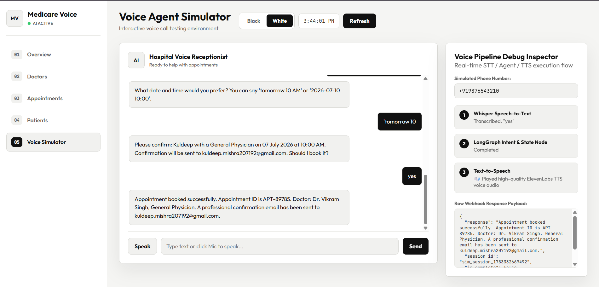
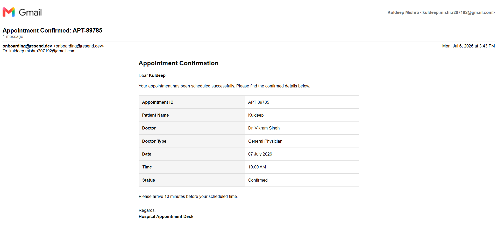

# 🏥 Multi-Doctor Voice Appointment Scheduling Agent

An intelligent, multi-doctor hospital voice receptionist agent that handles appointment booking, rescheduling, cancellation, and general medical inquiries through natural voice conversations.

---

## 🖼️ Preview & Dashboard Screenshots

| 🖥️ Admin Dashboard Overview | 🎙️ Interactive Voice Simulator |
|---|---|
|  |  |

---

## 🌟 Key Features

* ⚡ **Hybrid Ultra-Fast Pipeline**: Uses a **0ms Latency Deterministic State Engine** for standard booking steps & specialty inquiries, with automatic fallback to **Groq LLM (`llama-3.1-8b-instant`)** for complex off-script questions.
* 🎙️ **Voice Integration**: Supports **Vapi AI Webhooks**, **ElevenLabs Scribe STT / Whisper**, and **ElevenLabs TTS** for voice generation.
* 🤖 **LangGraph Agent Workflow**: State-machine orchestration using LangGraph with LangChain tools for real database querying and conflict validation.
* 🗓️ **Smart Conflict Validation Engine**: Prevents duplicate bookings, doctor overlaps, patient overlaps, and validates doctor working hours, working days, and leave dates.
* 📅 **Google Calendar Sync**: Automatically creates, updates, or deletes events on Google Calendar for booked appointments (with smart mock mode fallback).
* 📱 **Multi-Channel Notifications**: Sends confirmation, reschedule, and cancellation alerts via **Twilio SMS**, **Twilio WhatsApp**, and **Resend HTML Email**.
* 🖥️ **Interactive Admin Dashboard & Voice Simulator**: Web dashboard (`/dashboard`) featuring real-time metrics, appointment management, doctor management, patient directory, and a built-in voice call testing environment with Web Speech API support.

---

## 🏗️ Architecture & Voice Pipeline Flow

```
                               ┌─────────────────────────────────┐
                               │       User Voice Input          │
                               └────────────────┬────────────────┘
                                                │
                                                ▼
                               ┌─────────────────────────────────┐
                               │  ElevenLabs Scribe STT / Vapi   │
                               └────────────────┬────────────────┘
                                                │
                                                ▼
                               ┌─────────────────────────────────┐
                               │      Fast Voice Router          │
                               └──────┬──────────────────┬───────┘
                                      │                  │
                (Standard Booking/Inquiry)              (Complex Inquiry)
                                      │                  │
                                      ▼                  ▼
     ┌───────────────────────────────────┐    ┌───────────────────────────────────┐
     │ Deterministic Fast Rule Engine    │    │  LangGraph State Machine Agent    │
     │ • Instant <10ms response          │    │  • Groq llama-3.1-8b-instant      │
     │ • 0 Token Cost & Zero Latency     │    │  • Async Database Tools           │
     └────────────────┬──────────────────┘    └────────────────┬──────────────────┘
                      │                                        │
                      └───────────────────┬────────────────────┘
                                          │
                                          ▼
                      ┌───────────────────────────────────────┐
                      │ Async SQLAlchemy Database (SQLite/Pg) │
                      └───────────────────┬───────────────────┘
                                          │
                      ┌───────────────────┴───────────────────┐
                      │                                       │
                      ▼                                       ▼
     ┌───────────────────────────────────┐  ┌───────────────────────────────────┐
     │ Google Calendar API Event Sync    │  │ Multi-Channel Notifications       │
     │ (Create / Reschedule / Cancel)    │  │ (Twilio SMS, WhatsApp, Email)     │
     └───────────────────────────────────┘  └───────────────────────────────────┘
                                          │
                                          ▼
                      ┌───────────────────────────────────────┐
                      │ ElevenLabs TTS Voice Audio Output     │
                      └───────────────────────────────────────┘
```

---

## ⚡ Quick Start & Installation

### 1. Clone Repository & Setup Environment

```bash
# Clone the repository
git clone <repository-url>
cd voice-agent-for-doctor

# Create virtual environment
python -m venv venv

# Activate virtual environment
# Windows:
venv\Scripts\activate
# macOS/Linux:
source venv/bin/activate
```

### 2. Install Dependencies

```bash
pip install -r requirements.txt
```

### 3. Configure Environment Variables

Create a `.env` file in the project root:

```bash
cp .env.example .env
```

Edit `.env` and fill in your API keys (Groq, ElevenLabs, Twilio, Resend, Google Calendar, etc.).

### 4. Seed Database with Sample Doctors

Populate the database with initial doctors across 8 medical specializations:

```bash
python scripts/seed_doctors.py
```

### 5. Run Server

```bash
python run.py
# OR
uvicorn app.main:app --reload --host 0.0.0.0 --port 8000
```

---

## 🖥️ Accessing Interfaces

* **Admin Dashboard & Voice Simulator**: [http://localhost:8000/dashboard](http://localhost:8000/dashboard)
* **Swagger API Documentation**: [http://localhost:8000/docs](http://localhost:8000/docs)
* **ReDoc API Documentation**: [http://localhost:8000/redoc](http://localhost:8000/redoc)

---

## 📁 Project Structure

```
voice-agent-for-doctor/
├── app/
│   ├── main.py                    # FastAPI application entry point & static mounting
│   ├── config.py                  # Pydantic Settings & environment variables
│   ├── database.py                # Async SQLAlchemy engine & session factory
│   ├── models/                    # ORM Models (Patient, Doctor, DoctorLeave, Appointment)
│   ├── schemas/                   # Pydantic Schemas for API validation
│   ├── agents/                    # LangGraph workflow, nodes, tools, and shared state
│   │   ├── graph.py               # StateGraph workflow router definition
│   │   ├── nodes.py               # Node functions with LLM fallback
│   │   ├── state.py               # AgentState TypedDict definition
│   │   └── tools.py               # Async DB tools for LangGraph agent
│   ├── api/routes/                # REST API Routers
│   │   ├── auth.py                # Admin security middleware
│   │   ├── patients.py            # Patient CRUD & phone/code lookup
│   │   ├── doctors.py             # Doctor profile & availability slot generation
│   │   ├── appointments.py       # Appointment booking & conflict validation
│   │   └── voice.py               # Vapi AI webhook & voice simulator routes
│   └── services/                  # Core Business Logic Layer
│       ├── appointment_service.py # Conflict validation & booking logic
│       ├── doctor_service.py      # Doctor availability, shift hours & leave
│       ├── patient_service.py     # Patient registration & phone normalization
│       ├── calendar_service.py   # Google Calendar API sync
│       ├── elevenlabs_service.py # ElevenLabs TTS & STT integration
│       └── notification_service.py# SMS (Twilio), WhatsApp, & Email delivery
├── frontend/                      # Web Admin Dashboard & Simulator UI
│   ├── index.html                 # Single page app layout with Dark/Light theme
│   ├── app.js                     # Dynamic fetcher & Web Speech API integration
│   └── styles.css                 # Modern CSS design system
├── scripts/
│   └── seed_doctors.py            # Script to seed initial sample doctors
├── tests/
│   └── test_agents.py             # Pytest suite for symptom mapping logic
├── run.py                         # Application runner
├── requirements.txt               # Project dependencies
├── .env.example                   # Environment configuration template
└── README.md                      # Documentation
```

---

## 🔑 Environment Configuration (.env)

| Key | Purpose | Required? |
|---|---|---|
| `GROQ_API_KEY` | Groq LLM API key (`llama-3.1-8b-instant`) | Recommended |
| `ELEVENLABS_API_KEY` | ElevenLabs Text-to-Speech & Speech-to-Text | Optional (mock fallback) |
| `ELEVENLABS_VOICE_ID` | Voice ID (Defaults to Sarah voice) | Optional |
| `TWILIO_ACCOUNT_SID` / `TWILIO_AUTH_TOKEN` | Twilio SMS & WhatsApp notifications | Optional (mock fallback) |
| `RESEND_API_KEY` | Resend API for HTML Email confirmation | Optional (mock fallback) |
| `GOOGLE_CLIENT_ID` / `GOOGLE_CLIENT_SECRET` | Google Calendar event sync | Optional (mock fallback) |
| `ADMIN_API_KEY` | Admin API header key (`X-Admin-Key`) | Optional |

---

## 🧪 Running Tests

Run the test suite using `pytest`:

```bash
pytest tests/ -v
```

---

## 📜 License

MIT License. Developed for intelligent automated medical receptionist and voice appointment scheduling systems.
